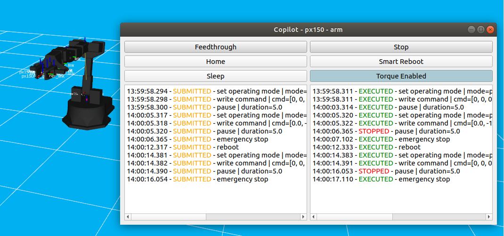

# interbotix_copilot
This repository contains a client/copilot package for Interbotix X-series manipulators (e.g. vx300s or px150). 

It allows clients to run experimental code that is potentially unsafe with oversight from a copilot.

At any moment, the copilot GUI allows users to perform an emergency stop that stops the execution of client commands, 
and brings the robot to a halt.

**As of now, safely commanding positions using moveit is not yet supported.** 

## Installation instructions

**Requirements**  
- [ROS1](http://wiki.ros.org/noetic/Installation) (tested with Noetic, Melodic compiled with Python3.)
- [Interbotix ROS Drivers](https://www.trossenrobotics.com/docs/interbotix_xsarms/ros_interface/index.html)  

**Python dependencies**  
- PyQt5
- yaml

1. Go to the src folder of your catkin workspace ([or create a new one if needed](http://wiki.ros.org/catkin/Tutorials/create_a_workspace)).
2. Next, clone this repo:
```bash
git clone git@github.com:bheijden/interbotix_copilot.git
```
3. Install ROS dependencies:
```bash
cd ../..
rosdep update
rosdep install --from-paths src --ignore-src -r -y
```
4. Make or build packages and source:
```bash
catkin_make
source devel/setup.bash
```
5. Verify installation:
```bash
roslaunch interbotix_copilot copilot.launch robot_model:=px150 robot_name:=px150 use_rviz:=True use_sim:=True dof:=5
```
If all is well, you should see something like this:


## Launching the copilot

**Supported Hardware**  
All Interbotix X-Series manipulators  

In the launch file copilot.launch, select the correct arguments related to
- `robot_model:=` Your robot type (e.g. `px150`, `vx300s`). Set the number of degrees of freedom (`dof`) of the corresponding arm group appropriately.
- `robot_name:=` Name given to the robot. In case you have multiple robots of the same type they might differ.
- `use_sim:=`If you want to use simulation or the real robot. In simulation, moveit is not used to move the arm. 

Note that you can move the robot upwards, to home, to upright, or to sleep (from home position only!) by clicking on *home*, *sleep*, in the copilot GUI, respectively.
Also note that a collision checker is active such that the robot doesn't move lower than its base.
You can press *Stop* in case of undesired movements. It will halt the robot in its current position.
You can press *Feedthrough* to allow feedthrough of client commands.
The log on the left show the submitted tasks, and the right log show the status of their execution.
The torques of the motor can be enabled and disabled using *Torque Enable* or *Torque Disable*, **BUT ONLY PRESS DISABLE WHEN YOU ARE HOLDING THE ROBOT OR WHEN YOU ARE IN SPACE, BECAUSE OTHERWISE IT WILL FALL DOWN DUE TO GRAVITY**.

## Launching the client

The client is a Python3 API that allows a client to send tasks to the copilot.
When feedthrough on the copilot GUI is:
- `Enabled`: the tasks will be scheduled in a queue to be executed on the robot.
- `Disabled`: the client tasks are simply discarded (except for register value writes).

The client Python API can be imported with:
```python
from interbotix_copilot.client import Client
```
A client can be instantiated with (matching the `robot_type`, `robot_name`, `group_name` arguments to `copilot.launch` above):
```python
client = Client(robot_type="px150", robot_name="px150", group_name="arm")
```
Tasks are executed in sequence on a single event thread (i.e. one after another), and can be scheduled as:
```python
# Sets the PID gains on the motors (always executes, regardless of copilot feedthrough status)
f = client.set_pid_gains(kp_pos=640, ki_pos=0, kd_pos=3600, kp_vel=100, ki_vel=1000, ff_vel=0, ff_acc=0)
# Schedule a task that waits for feedthrough to be enabled
f = client.wait_for_feedthrough()
# After feedthrough is enabled, we schedule a `go to the home` task.
f = client.go_to_home()
# None of the above task scheduling blocks. If we want to block, we can wait for the result of the Future.
f.result() # Blocks until `go_to_home` task is finished (Can either be executed/discarded/stopped)
```

If the copilot initiates an emergency stop, all tasks will be cancelled, including the client tasks.

It may be beneficial for the client to wait for feedthrough to be enabled, before sending tasks. 
This can be achieved by scheduling a `wait_for_feedthrough` task first (by calling `client.wait_for_feedthrough()`).
All tasks scheduled after this task will wait for the feedthrough to be enabled first.

All scheduled tasks return a [Future](https://docs.python.org/3/library/concurrent.futures.html#concurrent.futures.Future) object.
Users should only use `result()` to wait for completion of tasks.  
